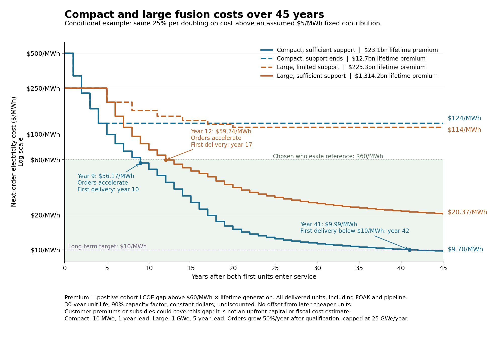
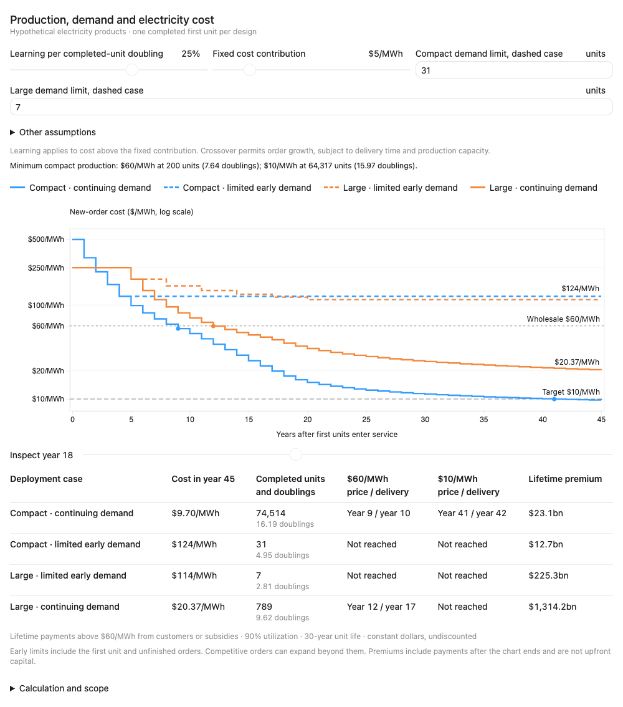

# The compact-learning corridor

Damien Scott

Published 30 September 2026

Canonical article: <https://1cf.energy/compact-learning-corridor/>

## I. The premise

A compact fusion machine could find paying customers even when its first-of-a-kind electricity costs substantially more than wholesale grid alternatives. Small units could serve remote or off-grid users whose alternatives are expensive, or customers willing to pay a premium for reliable local power. Those sales could support repeated manufacture, operating experience and further development.

This is the compact-learning premise in our [six-corridors study](https://1cf.energy/six-candidate-corridors/). Small units can require less total spending to build, test and revise, even when their initial electricity cost per MWh is higher than that of larger plants. The smaller investment in each unit can make repeated builds and design changes easier to finance. Shorter development cycles may also let them adopt better components sooner. The question is how far above wholesale grid alternatives the first product could start, and whether enough demand at each price could support the improvements needed to reach larger, more price-sensitive markets. Reaching wholesale competitiveness is the point at which a much larger customer base could support faster production and further cost reduction. The goal of this post is to identify what would need to be true for that process to reach the series target of $10/MWh.

> **The commercial test:** can compact fusion sell power above wholesale grid prices to enough early customers, reach larger markets, and sustain the production and improvement needed for $10/MWh?
>
> **The quantitative test:** four hypothetical paths start with a 10 MWe compact unit at $500/MWh or a 1 GWe large reactor at $250/MWh. Both learn 25% per doubling of completed production on costs above a chosen $5/MWh fixed contribution. With sufficient support, compact reaches a $60/MWh wholesale reference in year nine, expands production, and reaches $10/MWh for new orders in year forty-one. That requires about 64,500 completed units, or 645 GW of cumulative production. Large also crosses wholesale and expands, but reaches only about $20/MWh by year forty-five. With insufficient support, either can remain above wholesale cost.
>
> **The demand condition:** early customers or funders must cover each above-wholesale cohort's cost premium. At an assumed 90% capacity factor and 30-year operating life, the supported compact path needs $23.1 billion of lifetime premium commitments. The supported large path needs $1.314 trillion, including above-wholesale plants already under construction at crossover. These are undiscounted payment totals in constant 2025 US dollars, not upfront capital or necessarily public subsidies.
>
> **The evidence limit:** compact fusion experiments provide evidence of rapid development and specific plasma advances. They do not establish a qualified electricity product or a commercial production learning rate. The $5/MWh fixed contribution is an assumption. A whole-plant design would have to show that the costs not reduced by the modeled learning fit within it.

The corridor includes more than one confinement scheme and can overlap the [pulsed-power](https://1cf.energy/pulsed-power-corridor/), low-neutron and direct-conversion corridors. This study examines the conditions under which compactness could support development and deployment. A result for one illustrative product or one costing model does not settle the wider premise.

## II. Production, rework and redesign have different timelines

Building a new unit in a factory, modifying an installed machine and developing a revised design require different schedules and cost estimates.

| Quantity | What starts and ends the clock | What it tells us |
| --- | --- | --- |
| Factory production lead time | Release of a defined unit to manufacture through factory acceptance | How long it takes to produce one new unit. Procurement that occurs before release must be reported separately. |
| Order-to-service lead time | A firm order through transport, site work, installation, commissioning and useful operation | How long a customer's order takes to become an operating unit. This includes more than factory manufacture. |
| Production and delivery rate | Accepted or commissioned units per month or year | How quickly cumulative production grows. Parallel work can make the interval between finished units much shorter than the time needed to produce each one. |
| Shutdown and rework outage | Taking an installed machine out of service through modification, checks and return to operation | How quickly an existing unit can be changed, and how much useful output is lost during that work. |
| Design revision cycle | Identifying a change through redesign, fabrication of test articles, testing and qualification | How quickly an improvement becomes ready for later units or an approved retrofit. Its duration can exceed the physical rework outage. |

These quantities can differ substantially. A short maintenance outage does not establish a short production lead time. A factory can deliver many identical units while the next design revision is still being tested. Several units built in parallel create production experience, but their designs cannot incorporate operating lessons that arrive only after they enter service.

The existing compact-fusion examples establish narrower claims. Avalanche reports a 60-day build and three months to first plasma for Lando. That is a company-reported prototype development interval. It does not establish a qualified product's factory lead time, production rate or shutdown-to-restart outage.[1] Zap's published eight-month interval covers the design, construction, assembly, commissioning and first plasma of the FuZE-Q power bank. It is not a commercial power-plant delivery interval.[2]

**Manufacturing learning** reduces the cost of producing a defined, qualified item. Repeated assembly can spread tooling cost, improve yield and reduce labor. The experience unit might be a switch, electrode assembly, vacuum package or complete reactor. It must match the cost account being improved. The numerical example below holds the learning percentage equal between two architectures and varies the production they complete over time.

**Experimental and operating learning** change what we know about performance and reliability. Reworking a test device may enable another experiment without producing another commercial unit. Many pulses can reveal wear and failures, but they do not count as manufacture of the same number of machines. Replacement parts add production experience while also adding cost and possibly downtime.

**Technology refresh** can improve later units when new components become qualified for use. A revised switch or magnet may require new protection, controls or interfaces. Repeated redesign can also interrupt a production process that was becoming cheaper. Aircraft-production research provides evidence of incomplete transfer and forgetting across product generations, which is a reason to track retained experience explicitly.[3]

Smallness may help through cheaper test articles, shorter engineering revisions, faster product delivery, more affordable individual projects, or a larger set of potential customers. Wilson and colleagues find cross-technology evidence associating smaller, more divisible technologies with faster learning and diffusion. That motivates the corridor without supplying a measured compact-fusion coefficient.[4]

Tang and colleagues map characteristics of selected magnetic and laser D-T plant designs to historical analogues and infer whole-plant specific-capital-cost experience rates of 2–8%. These are expectations for the designs studied, not observations of a fusion fleet or a universal bound on alternatives. A compact design must show which characteristics support a different production and improvement process.[5]

PV served small early applications, including satellites and remote power, before much larger markets developed.[15] Its price decline reflected research, factory scale, efficiency gains and manufacturing improvement, supported by expanding demand. Kavlak, McNerney and Trancik's reconstruction shows why the entire experience curve cannot be attributed to learning by doing.[6]

## III. The physics and product requirements

The relevant size is the complete product delivered to a customer. A 100 MWe unit is smaller than a gigawatt reactor but can still be far too large for an early application. A hypothetical mine or military installation needing 10 MWe cannot use the full output of a 100 MWe unit without substantial additional demand or an export connection. We use 10 MWe as a chosen example, not as a general estimate of either market's loads.

A compact plasma does not establish a compact power system. Power supplies, vacuum equipment, shielding, conversion, heat rejection and maintenance access can dominate the delivered product. A promising experiment can therefore belong in this corridor's research program without yet demonstrating a small commercial unit.

The following examples summarize public evidence from three compact-fusion families.

| Family | Public evidence relevant to the premise | What the evidence does not yet establish |
| --- | --- | --- |
| Electrostatic and crossed-field devices, represented by Avalanche | A peer-reviewed 100 kV electrostatic orbitrap experiment reported ion confinement up to 0.8 ms and density around 1–2 × 10¹⁴ m⁻³. It measured neutrons, predominantly from beam-target reactions at the cathode. The company reports rapid device builds. | The orbitrap experiment omitted the applied magnetic field and confined electrons of the proposed integrated device. It does not demonstrate the integrated density, gain, power balance or lifetime of a compact electricity product.[1,7] |
| Sheared-flow-stabilized Z-pinch, represented by Zap | Peer-reviewed measurements report electron temperatures of 1–3 keV coincident with fusion neutron production. Published work also reports rapid power-bank development and a conditional scaling path toward scientific gain. | Higher-current stability, net electric output, repetitive operation, electrode life and plant economics remain separate requirements. A scientific-gain scaling projection is not an electrical-gain measurement.[2,8] |
| Dense plasma focus, represented by LPPFusion, with Fuse as a radiation-source comparator | LPPFusion reports a 0.26 J fusion-yield shot in deuterium. Fuse has published diagnostic and neutron-source work on FAETON-I. | A company-reported yield and a published neutron-source result do not establish a compact p-B11 electricity product. A useful radiation source may have customers while a power-producing design remains unproven.[9,10] |

A peer-reviewed measurement, a developer's build record, a theoretical scaling and a commercial target answer different questions. Peer review does not turn every operating point discussed in a paper into a demonstrated result.

For example, Zap's 2023 paper projects D-T-equivalent scientific gain of one at currents that depend on the assumed compression trajectory. That boundary differs from fusion energy divided by capacitor-bank energy and from net electrical output. Electrode replacement also has to be costed at the plant's repetition rate. Published erosion work identifies a substantial engineering issue, but its reactor estimate is an extrapolation rather than a lifetime demonstration.[2,11]

The complete operating point required here is a module that exports useful electricity after its own loads. Its power balance must include drive power, magnets, pumps, vacuum, cooling, controls and any fuel-handling system. Pulsed designs also need recharge and energy-recovery losses, consumable use and duty cycle. Conversion efficiency and component life must refer to the same operating conditions as the plasma calculation.

None of these examples demonstrates the complete operating point required for a commercial electricity product.

Electrostatic concepts must establish adequate confinement and density with a sustainable ion and electron power balance. A p-B11 product must also account for radiation and the power required to maintain its reacting ion population. Neutron-source performance on deuterium does not establish those conditions.

Further evidence is needed on plasma performance, net power, reliable operation and delivered customer cost.

## IV. Early customers above wholesale prices

An early customer must compare the delivered cost and performance of its proposed installation with the alternatives available at that site.

A customer may value avoided diesel consumption, reduced fuel transport, resilience, less exposure to fuel-price changes, or power where new grid capacity is difficult to obtain. Those benefits can justify a high electricity price. They need a site-specific comparison that includes installation, maintenance, backup and the alternatives available to that customer.

| Candidate application | Evidence for investigating it | What is needed before counting orders |
| --- | --- | --- |
| Remote communities and industrial sites | Official utility reports document expensive fuel-dependent systems and measurable electricity use. Small units may match local loads. | Avoidable generation cost, load shape, replacement schedule, installation and service cost, backup needs, local acceptance and a financeable purchase. |
| Military and other difficult-to-supply sites | A small power source could reduce fuel logistics or provide a valued service. | An application-specific procurement requirement, qualified product and contract. A high fully burdened fuel cost does not by itself establish the electricity price or quantity that will be purchased. |
| Ships | Onboard power can be valuable, and fuel and emissions constraints can change the comparison. | A credible marine installation, shielding and heat rejection, maintenance access, qualification and competing propulsion economics. We assign no numerical order volume here. |
| Constrained grids and large private loads | Earlier fusion-market research identifies regional electricity markets where higher prices could support initial plants. | Current price and reliability requirements, interconnection or site constraints, financeable offtake and the appropriate product scale. Historical market benchmarks are not current quotations.[12] |
| Irradiation, isotopes and other non-electric products | A compact experimental platform may sell useful services before it exports electricity. | Net revenue after the cost of that service, and evidence that its hardware and operating experience transfer to the electricity product. Revenue can support development without proving power-plant economics. |

Nunavut's residential tariff increased from C$0.6733/kWh to C$0.7494/kWh in April 2025. Retail tariffs include costs beyond generation, so they cannot be treated directly as the price available to a generator. Distribution, subsidies and other service costs affect the comparison.[13]

In Alaska in FY2024, participating Power Cost Equalization utilities reported 471.75 GWh sold across 188 communities. Their reported total operating cost was 47.53 US cents/kWh. That cost includes fuel and non-fuel expenses. It cannot all be treated as savings available to a replacement generator.[14]

Those annual sales correspond to 53.85 MW of average delivered load, or about 59.84 MW of generation at an assumed 90% capacity factor. That aggregate is spread across 188 communities. It is not evidence of six sites that could each use a 10 MWe unit. Load distribution, existing non-diesel supply, backup needs, replacement timing and local alternatives determine how many units of a particular size could be sold. Actual site design may require more installed capacity and lower utilization, which changes its economics.

This compares one replacement of existing supply at unchanged annual demand. Repeat replacement orders, demand growth or sales of compatible hardware elsewhere could add production over time. They require an explicit schedule, cost and lifetime model. Premature replacement adds cost as well as manufacturing experience.

A valuable small market can support development without providing enough orders to reach wholesale competitiveness.

## V. Production required to reach $10/MWh

Consider a compact design whose first unit exports 10 MWe at $500/MWh and a large design whose first reactor exports 1 GWe at $250/MWh. Both start above a chosen $60/MWh wholesale reference. Both have one completed first-of-a-kind unit at year zero. We compare a supported deployment program and a program with insufficient support for each design. The numerical comparison assumes two electricity products without specifying their fuel or confinement method.

The illustration asks what must happen between expensive first power, wholesale competitiveness and $10/MWh. The first cost, learning rate, customer demand and production schedules are all chosen assumptions. Starting with operating FOAKs also leaves their prior development time and spending outside the calculation.

### Common assumptions and different delivery times

| Assumption | Compact | Large |
| --- | --- | --- |
| Net output per unit | 10 MWe | 1 GWe |
| FOAK electricity cost | $500/MWh | $250/MWh |
| Fixed contribution to electricity cost | $5/MWh | The same $5/MWh |
| Learning on cost above that contribution | 25% per completed-production doubling | The same 25% |
| Order-to-service lead time | 1 year | 5 years |
| Order growth after reaching $60/MWh | 50% annually, rounded to whole units | The same 50% |
| Assumed annual production ceiling for supported programs | 2,500 units, or 25 GWe | 25 reactors, or 25 GWe |
| Capacity factor and operating life for premium accounting | 90%, 30 years | The same |
| Observation horizon after the FOAK enters service | 45 years | The same |

The cost of a new order is:

`C = $5/MWh + (FOAK cost − $5/MWh) × N^log₂(0.75)`

N is completed units of that design. Each order uses the experience available when it is placed. Its cohort retains that cost when delivered, even if a later order becomes cheaper. Units still under construction do not supply completed-production learning. The [learning-rates post](https://1cf.energy/material-multipliers-and-learning-curves/) explains why this experience boundary needs to be explicit.

The fixed contribution is essential to the result. A floor above $10/MWh makes the target impossible at any production volume. A floor of exactly $10/MWh can only approach it asymptotically under this rule. Choosing $5/MWh leaves another $5/MWh for the remaining learnable costs when the target is reached. It is an aggressive cost budget that a whole-plant design would have to support. All costs that do not decline through the modeled learning process must fit within that contribution. No validated allocation across fuel, staffing, maintenance, site facilities, conversion and other plant accounts is supplied here.

The one-year and five-year leads include production, delivery and commissioning. They do not describe rework outages or design revision cycles. Projects can overlap. The common 25 GWe annual ceiling is a chosen industrial capacity limit, not a forecast. It keeps the market expansion finite while allowing both supported paths to accelerate. Extending the observation to forty-five years lets us test whether continued production can reach $10/MWh. Waiting without producing more units provides no learning in this model.

### Cost and deployment results

*Figure 1. Cost available to a new order, not the average cost of the existing fleet. Both designs learn 25% per completed-production doubling on cost above a hypothetical $5/MWh fixed contribution. Supported programs increase orders after crossing the $60/MWh reference, subject to their delivery leads and the common annual capacity ceiling. Compact reaches $10/MWh for a new order in year forty-one, with delivery in year forty-two. Premium labels sum the full operating-life commitments for above-wholesale cohorts commissioned through year forty-five, including pipeline plants. They assume 90% capacity factor and a 30-year life, in constant dollars without discounting. All paths are hypothetical.*

| Path | Wholesale crossover for new orders | First competitive delivery | Year-forty-five new-order cost | Lifetime above-wholesale premium |
| --- | --- | --- | --- | --- |
| Compact, sufficient support | Year 9 | Year 10 | $9.70/MWh | $23.1 billion |
| Compact, support ends | Not reached | None | $124/MWh | $12.7 billion |
| Large, limited support | Not reached | None | $114/MWh | $225.3 billion |
| Large, sufficient support | Year 12 | Year 17 | $20.37/MWh | $1,314.2 billion |

**Compact, sufficient support.** Early customers support 237 completed units, or 2.37 GW, before the first competitive cohort enters service. In year nine, new-order cost reaches $56.17/MWh. Orders then grow by 50% a year, beginning with 90 units delivered in year ten. Production reaches its assumed 2,500-unit annual ceiling in year nineteen. Continued production brings the total to 64,514 units in year forty-one, when new-order cost reaches $9.99/MWh. The first cohort ordered at that cost enters service in year forty-two. By year forty-five, cumulative production is 74,514 units, or 745.14 GW, and next-order cost is $9.70/MWh.

**Compact, support ends.** Buyers or funding cover only the FOAK and 30 follow-on units. Production stops at 31 units in year four. The cost available to a further order is $124.02/MWh and stays there. The program has not completed enough production to reach the broader electricity market. Reworking the same units or waiting longer does not supply additional manufacturing doublings.

**Large, limited support.** The program completes six follow-on reactors in years 5, 8, 11, 14, 17 and 20. Seven completed units provide only 2.81 doublings from the FOAK. New-order cost remains $114.25/MWh. The lower starting cost alone has not supplied enough repetitions to reach wholesale competitiveness.

**Large, sufficient support.** A much larger early commitment supports orders rising from one reactor in year zero to ten annually in year nine, then ten annually until crossover. New-order cost reaches $59.74/MWh in year twelve, after 37 completed reactors. Orders then increase to 15, 23 and 25 annually. With the five-year lead, those accelerated deliveries begin in year seventeen. By year forty-five, cumulative production is 789 reactors, or 789 GW, and next-order cost is $20.37/MWh. This path reaches wholesale competitiveness and expands, but does not reach $10/MWh within the illustrated period.

These cases show how initial cost, order volume and delivery time interact. Small units can accumulate many production repetitions while supplying relatively little capacity. A large design can also reach competitiveness, but the illustrated path requires customers or support for far more above-wholesale capacity. Once either design becomes competitive, the model assumes the broader electricity market and funded manufacturing expansion support faster orders. Reliability, siting, interconnection and customer requirements still determine actual sales.

### What would have to be true for $10/MWh

In the supported compact case, the first stage requires customers or funding for 2.37 GW of above-wholesale units. The next stage requires a much larger market: sustained delivery of 2,500 units a year and about 645 GW of cumulative completed production before new orders reach $10/MWh. Wholesale crossover makes that expansion economically conceivable. It does not establish that the factories, finance, service network or customers will be available.

The assumed learning rate must also persist for almost sixteen doublings from the first completed unit. With the $5/MWh fixed contribution, the learnable portion falls from $495/MWh to about $5/MWh. That requires roughly a 99% reduction in this portion of cost, with improvements retained across decades of production. Completed-unit count is an accounting proxy for that experience, not evidence that each manufacturing or operating account can improve by the same amount.

The following sensitivity cases change one assumption at a time for the supported compact program. They use the same FOAK cost, early order rule, one-year delivery lead, wholesale-triggered expansion and 25 GWe annual ceiling. The unit thresholds are mathematical minima. Actual orders use the experience available after a full cohort is completed, so the scheduled crossing can occur at a larger count.

| Fixed contribution | Learning per doubling above it | Minimum completed 10 MWe units for $10/MWh | Cumulative completed capacity | First $10/MWh order / delivery within 45 years |
| --- | --- | --- | --- | --- |
| $5/MWh | 20% | 1,581,282 | 15,812.82 GW | Not reached |
| $5/MWh | 25% | 64,317 | 643.17 GW | Year 41 / year 42 |
| $5/MWh | 30% | 7,555 | 75.55 GW | Year 17 / year 18 |
| $2/MWh | 25% | 21,030 | 210.30 GW | Year 24 / year 25 |
| $8/MWh | 25% | 576,460 | 5,764.60 GW | Not reached |

These are conditions to test, not estimates of what fusion will achieve. A higher sustained learning rate reduces both the production needed for $10/MWh and the early support needed to reach wholesale competitiveness. A higher fixed contribution leaves less room for the remaining learnable costs and sharply increases the required production. If the fixed contribution is $10/MWh or more, neither a faster learning rate nor a longer production period can produce a finite-volume cost at or below $10/MWh under this rule.

The forty-five-year horizon is longer than the assumed thirty-year life of an individual unit. Cumulative completed capacity measures manufacturing experience, including retired units. It is not the surviving operating fleet. The calculation assumes experience remains useful after the original machines retire. It does not derive orders from replacement needs or credit replacements with a separate cost benefit.

The large design's lower FOAK cost means it needs fewer doublings to reach $10/MWh, about 13.53 rather than 15.97. But at 1 GWe per unit, its mathematical threshold is 11,814 reactors, or 11,814 GW of cumulative production. The comparison depends on counting whole units as the experience measure. Large reactors also repeat many components within each plant, so this illustration cannot establish that compact systems necessarily have the same advantage for every cost account.

### Above-wholesale premium commitments

For each cohort j, the calculation is:

`Lifetime premium_j = max(cohort cost_j − $60/MWh, 0) × cohort MW × 8,760 hours/year × 90% × 30 years`

The total adds those commitments across every cohort commissioned within the forty-five-year illustration. It treats a level annual electricity payment equal to each cohort's modeled LCOE as sufficient to cover that cohort's modeled costs. All figures use constant dollars and are undiscounted. They are lifetime payment commitments, not sums that must all be paid before crossover and not upfront construction capital.

The premium can come from several sources. An early adopter may pay above the wholesale reference because dense, firm power at a particular location is more valuable to it. A remote user may avoid expensive fuel and logistics. Procurement or demand subsidies may cover part of the gap. The chart adds the above-reference payments without assigning them to private buyers or public funders. It does not establish that those buyers or subsidies exist.

Earlier plants retain their higher costs after later plants become competitive. This is especially consequential for the large program's construction pipeline. It reaches a competitive new-order cost after 37 reactors are completed, but another 39 reactors have already been ordered above the benchmark. Their delivery in years thirteen through sixteen brings the above-wholesale commitment to 76 reactors, or 76 GW. All 76 count toward the $1.314 trillion lifetime total. The compact program's shorter delivery lead leaves 237 units, or 2.37 GW, in its above-wholesale cohorts.

The totals belong to these procurement schedules. Different order sizes or more time to incorporate operating feedback could change both the premium commitment and the date of competitiveness.

The $12.7 billion and $225.3 billion totals for the two unsuccessful paths are commitments associated with the plants they do complete. They are not estimates of the additional support needed to rescue those programs. Later below-wholesale plants are not used to cancel earlier premium commitments. Development spending, factory investment and any project funding gap beyond the modeled electricity revenue are also outside this measure.

The accompanying calculation also records payments during the plotted period. By year forty-five, both compact programs have paid their full modeled lifetime premiums. Payments for limited large total $221.2 billion and for supported large $1,313.7 billion within that period. The remaining commitments fall after the chart ends because some above-wholesale large plants are still within their thirty-year lives.

### Cost reduction after wholesale competitiveness

The large design needs fewer completed-unit doublings to reach the wholesale benchmark because its initial LCOE is lower: about 5.21 doublings, or at least 37 reactors, versus 7.64 doublings, or at least 200 compact units. Cohort timing makes the actual supported paths cross at 37 and 237 completed units. The required capacity and premium are separate from the number of repetitions.

Fewer past doublings do not by themselves create a better future learning rate. At the same $60/MWh cost and $5/MWh fixed contribution, either design's next doubling reduces cost to $46.25/MWh. The following doublings give $35.94/MWh and $28.20/MWh. How quickly those reductions arrive depends on the production that can be completed next.

At the calendar date when the large design crosses, compact is already at about $38/MWh. Large therefore has more dollars per MWh left to reduce toward the common floor at that point. Its later cost decline still depends on additional production and the assumed learning rate. The figure gives large the same opportunity to accelerate once it becomes competitive, with its longer delivery lead.

The 25% rate is a favorable scenario assumption. Whole-unit count is a simplified proxy for relevant manufacturing experience. Large reactors also repeat components within a plant, and compact designs can lose experience when their configuration changes. A real assessment must identify which cost accounts learn, their production histories, retained experience, floors and qualification delays. This illustration makes the commercial sequence explicit without supplying a validated fusion learning coefficient or a bottom-up plant cost estimate.

### Explore the assumptions

The [learning dashboard](https://learning.1cf.energy/v10/) lets you set compact and large FOAK costs separately, then change the learning rate, fixed cost contribution, early demand and production assumptions. It recalculates wholesale crossover dates, progress toward $10/MWh and lifetime above-wholesale premium commitments. Its default settings reproduce Figure 1. Raising an early-demand limit can allow a stalled case to reach wholesale competitiveness and expand production.

*Learning dashboard with the article's default assumptions: compact FOAK $500/MWh, large FOAK $250/MWh, 25% learning above a $5/MWh fixed contribution. [Open the dashboard](https://learning.1cf.energy/v10/) to change the inputs. All trajectories are hypothetical.*

### Moving to larger units

The numerical example keeps each compact unit at 10 MWe to isolate the effect of customer volume and delivery cadence. A commercial strategy need not remain at that size.

A developer might first sell a 10 MWe unit suited to an isolated mine or other high-value site, then develop a larger individual reactor as cost, performance and reliability improve. A later 50 or 100 MWe unit could serve customers whose loads justify that output. Scaling the reactor itself is different from installing five or ten copies of the original module. Both routes, and combinations of them, belong within this corridor.

Larger individual units may spread site facilities, controls and staffing across more output. Whether they also reduce reactor cost per kilowatt depends on confinement, magnets or drivers, heat removal, structural loads and maintenance. The move to a larger unit can therefore provide a separate cost-reduction mechanism alongside manufacturing learning. This illustration does not assign it an automatic discount.

Earlier experience transfers where components, materials, processes and operating requirements remain relevant. A larger chamber, magnet or conversion system may require substantial new design and qualification. Its production baseline should identify the manufacturing work retained from the smaller product and the work being done for the first time. Ten completed 10 MWe units are not automatically ten repetitions of a new 100 MWe design.

The early product must therefore be small enough for its intended customers, while the architecture must offer a credible route to the size and cost required by later markets. A credible route to larger individual units is part of the compact-learning hypothesis.

## VI. Whole-plant requirements for $10/MWh

The production calculation specifies the cost reductions needed to reach $10/MWh. An engineering estimate must show how an actual plant could achieve those costs.

At the assumed 90% capacity factor, a 10 MWe unit exports 78,840 MWh a year. A cost of $10/MWh allows $788,400 in total annualized costs, including capital recovery, staffing, fuel, maintenance, replacements and other operating expenses. The assumed $5/MWh fixed contribution uses $394,200 of that allowance. The remaining learnable costs must fall to $394,200 a year or less. These amounts are calculated from the target price and output. They are cost limits for a proposed design, not estimates of what its components will cost.

The output must be net electricity delivered after the plant's own consumption:

`Net electrical output = gross electrical output − drive power − magnet power − cooling and pumping − other plant loads`

Component cost and electrical consumption must describe the same equipment and operating conditions. A resistive magnet's conductor mass, current density, temperature, cooling requirement and electrical loss must be calculated together. A superconducting magnet needs its own conductor, structure, protection and cryogenic accounts. Pulsed systems need a consistent repetition rate, driver efficiency, energy recovery and consumable life. Conversion equipment and heat rejection must be sized to the resulting power balance.

The estimate must also identify which costs can improve through repeated production. Each eligible account needs a starting cost, a production baseline, a learning mechanism and a minimum cost consistent with the design. Components already produced in large volumes cannot be treated as though their manufacturing experience starts with the first fusion unit. A revised design may retain some manufacturing experience while requiring new development and qualification elsewhere.

Installation, staffing, maintenance and financing must reflect the product customers buy. Costs for a shared site cannot be assigned to a standalone 10 MWe installation without accounting for its own facilities and staff. Replacement parts add manufacturing experience, but their cost and the associated downtime remain expenses of the operating plant.

These calculations would establish whether a particular design can fit the assumed $5/MWh fixed contribution and sustain the modeled reductions in other costs. The learning trajectory identifies the required result. A whole-plant estimate must substantiate it.

## VII. Evidence and assumptions

We retain the series' four categories: conditional design basis, best applicable evidence, extrapolation with a mechanism, and speculation. Source type is recorded separately. A design basis is not a measurement. A record achieved in another industry does not make its direct application to compact fusion a record.

| Question | Best evidence available here | What remains an extrapolation or chosen assumption |
| --- | --- | --- |
| Can experiments be built quickly? | Developer-reported small-device builds and published development histories | The duration and cost of a fully integrated, qualified power-product iteration |
| Can the device export reliable net power? | Specific plasma, diagnostic and subsystem measurements | The integrated operating point, conversion, auxiliaries and service life of an electricity module |
| Can manufacture reduce cost rapidly? | Historical industrial learning and mechanisms such as repeated assembly and improved yield | The compact product's rate, eligible accounts, engineering floor and retained experience |
| Can early customers support enough production? | Measured electricity use and cost information for particular markets | Addressable share, financeable prices, procurement timing and subsequent markets |
| Can the mature plant reach $10/MWh? | Calculation of the production and cost budget required under stated assumptions | A whole-plant design consistent with the $5/MWh fixed contribution, the sustained learning rate and the required demand and production |

Evidence grades describe the support for a claim. The $5/MWh main fixed contribution, the 25% main learning rate, the alternative rates and contributions in the sensitivity cases, the 30-year operating life, the 90% utilization and the production schedules are scenario inputs. Learning rates observed in other industries do not establish these rates for fusion. The initial prices, one completed FOAK per design, delivery schedules and customer volumes are also assumptions chosen to make the comparison possible.

The comparison uses hypothetical electricity costs in constant 2025 US dollars. Lifetime premium accounting assumes 90% utilization and 30 years of operation. Capital and financing costs are included in the assumed electricity prices but are not estimated separately. A comparison with a specific reactor design would require the same cost boundaries, utilization, operating life and financing assumptions.

## VIII. Evidence needed next

Compact fusion could reach paying customers before its electricity becomes competitive with wholesale grid alternatives. Small units could match high-value applications, while repeated production and short development cycles could reduce costs enough to reach wholesale competitiveness. The resulting access to larger markets could support the much greater production needed to approach $10/MWh.

A compact program would need to show a consistent net-power balance, a production-intent bill of materials, installed customer cost, component lifetime and service requirements. It would define the starting production state, identify which manufacturing work repeats, and show enough obtainable orders or explicit support to reach the next price threshold.

The most useful near-term evidence would combine a measured operating point with an independently checkable engineering and customer case. For a pulsed device, that includes consumable life and replacement cost at useful repetition rate. For an electrostatic device, it includes the complete confinement, magnet and drive-power balance. For either, delivered cost and reliability must be measured on the same configuration that customers would buy.

The hypothetical trajectory reaches $10/MWh when several demanding conditions hold together: a $5/MWh fixed contribution, 25% learning on the remaining costs sustained for almost sixteen doublings, support for the expensive early cohorts, and enough subsequent demand and delivery capacity to complete about 64,500 compact units. A commercial design and its customers would have to meet these conditions, or support a different quantified route to the target.

## Reproducibility and scope

The [trajectory script](assets/four_case_trajectory.py) defines the four paths, cohort timing, learning rule and premium accounting. It generates the [annual trajectories](assets/annual_trajectory.csv), [cohort costs](assets/cohort_costs_and_premiums.csv), [premium requirements](assets/premiums.csv), [assumptions](assets/assumptions.json), [milestones and numerical checks](assets/milestones-and-summary.json), the [conditions for $10/MWh](assets/target-envelope.csv) and Figure 1. The [model note](assets/model-note.md) describes the accounting boundaries. Numerical reproduction uses Python's standard library; plotting additionally uses Matplotlib.

The [interactive calculation](https://learning.1cf.energy/v10/) uses the same accounting rules and reproduces the default trajectories. Its [model documentation](https://learning.1cf.energy/v10/model.html) explains the assumptions and links to the downloadable calculation. The [source repository](https://github.com/1cFE/learning) includes the code, numerical checks and instructions for running it locally. The article links to a fixed version so its model and defaults remain available as the dashboard develops.

The [evidence ledger](assets/evidence-ledger.md) separates source observations from chosen assumptions. The production calculation uses assumed electricity costs and does not calculate a reactor design, fuel cycle or plasma operating point.

## Conflict of interest

Damien Scott is a co-founder of Borealis Fusion, a company developing proton-boron-11 fusion. Astera Institute is an investor in Borealis Fusion. This analysis was produced within the 1cFE residency at Astera Institute.

## Appendix A. Calculation boundaries

**Experience and cohort costs.** All paths start with one completed FOAK. Each year's due completions are counted before new orders are priced. Learning uses only completed production, with no credit for units still under construction or other units in the same order cohort. Each cohort keeps the cost calculated when it was ordered. Existing plants are not repriced.

**Compact schedules.** The supported compact program's early-market orders are 2, 4, 8, 16, 24, 32, 40, 50 and 60 units in years zero through eight. Crossing in year nine activates `min(2,500, ceil(1.5 × previous_year_actual_orders))`. Orders are 90, 135, 203, 305, 458, 687, 1,031, 1,547 and 2,321 in years nine through seventeen, then 2,500 annually through year forty-four. They commission one year later. The insufficient-support path accepts only the first four follow-on cohorts, totaling 30 units, and then stops.

**Large schedules.** The limited program orders one reactor at years 0, 3, 6, 9, 12 and 15, each commissioning five years later. The supported program orders one reactor in year zero, two in year one, increasing to ten in year nine and then ten annually through year eleven. Crossing in year twelve activates `min(25, ceil(1.5 × previous_year_actual_orders))`, producing orders of 15, 23 and then 25 annually through year forty. These enter service five years after their orders. The capacity ceilings and delivery times are assumptions about funded industrial capability.

**Timing and the horizon.** The chart ends at year forty-five. New orders cease early enough for every modeled cohort to commission within that horizon. A plotted next-order cost at the endpoint is an estimate from completed experience, not an additional order. Cumulative completed units measure production experience, including the FOAK and units retired after thirty years. They are not a forecast of the surviving operating fleet at that date. Experience is assumed retained after retirement.

**Premium accounting.** The lifetime measure sums `max(cohort LCOE − $60/MWh, 0) × cohort MW × 8,760 hours/year × 0.9 × 30 years` for all cohorts commissioned through year forty-five. It includes the FOAK and above-wholesale pipeline plants. The secondary payment-to-date measure replaces the 30-year life with `max(0, min(30, 45 − commissioning_year))` years. Commissioning occurs at the stated integer date and operation is counted over the half-open interval ending at year forty-five. A cohort commissioned at year forty-five has a full lifetime commitment but no payments yet inside the plotted period. No present-value discount is applied. Cheap later cohorts contribute zero rather than offsetting earlier premiums.

**Financial scope.** FOAK and cohort LCOEs summarize assumed capital, operating and financing costs. Premium accounting describes the electricity payments above the reference needed to cover those modeled costs, not an additional capital charge. The 30-year life and 90% utilization are chosen payment-accounting inputs, not demonstrated performance. Development costs, factory investment, construction cash requirements, commercial margins and bankability are not separately estimated.

**Evidence feedback and size.** Completed experience is assumed available to the next order immediately. A real process change, redesign or qualification delay could defer the improvement. Physical scale-up, replacement-driven production, degradation and transfer to new configurations are not independent cost levers here. Larger individual compact reactors remain a possible subsequent product strategy, as discussed above.

**Learning thresholds.** For a target T above fixed contribution F and below FOAK cost, the minimum completed-unit count is `ceil([(T − F) / (FOAK cost − F)]^(1 / log₂(1 − learning_rate)))`. At F = $5/MWh and 25% learning, the $60/MWh thresholds are 200 compact units or 37 large reactors. The actual schedules reach 237 and 37 before placing their first qualifying orders. For $10/MWh, the mathematical thresholds are 64,317 compact units or 11,814 large reactors. The supported compact schedule reaches 64,514 completed units before its first qualifying order in year forty-one. These are scenario calculations, not empirical fusion thresholds.

## References

1. Avalanche Energy, [Lando machine record](https://www.avalanchefusion.com/machines/lando). Developer-reported build and first-plasma milestones.
2. Levitt et al. (2023), [The Zap Energy approach to commercial fusion](https://doi.org/10.1063/5.0163361). Developer-authored peer-reviewed account of development and conditional gain scaling.
3. Benkard (2000), [Learning and Forgetting: The Dynamics of Aircraft Production](https://www.aeaweb.org/articles?id=10.1257/aer.90.4.1034). Industrial evidence relevant to experience retention.
4. Wilson et al. (2020), [Granular technologies to accelerate decarbonization](https://ueaeprints.uea.ac.uk/75137/1/Accepted_Manuscript.pdf). Cross-technology evidence and applicability conditions.
5. Tang et al. (2026), [Fusion power experience rates are overestimated](https://www.nature.com/articles/s41560-026-02023-8). Analogy-based whole-plant specific-capital-cost expectations.
6. Kavlak, McNerney and Trancik (2018), [Evaluating the causes of cost reduction in photovoltaic modules](https://doi.org/10.1016/j.enpol.2018.08.015). Historical decomposition of PV cost changes.
7. Merthe et al. (2025), [Mode-enhanced ion loading in a 100 kV orbitrap](https://pubs.aip.org/aip/pop/article/32/9/092105/3362035/Mode-enhanced-ion-loading-in-a-100-kV-orbitrap). Laboratory ion-loading, confinement and neutron measurements.
8. Levitt et al. (2024), [Elevated Electron Temperature Coincident with Observed Fusion Reactions in a Sheared-Flow-Stabilized Z Pinch](https://doi.org/10.1103/PhysRevLett.132.155101). Laboratory temperature measurements.
9. LPPFusion (2025), [Another record yield: understanding our progress](https://www.lppfusion.com/another-record-yield-understanding-our-progress/). Developer-reported deuterium yield.
10. Fuse research team (2025), [FAETON-I study](https://doi.org/10.1038/s41598-025-07939-x). Published laboratory study of plasma dynamics and neutron-source performance.
11. Thompson et al. (2023), [Electrode durability and sheared-flow-stabilized Z-pinch fusion energy](https://pubs.aip.org/aip/pop/article/30/10/100601/2915124/Electrode-durability-and-sheared-flow-stabilized-Z). Engineering analysis and extrapolation of electrode wear.
12. Handley, Slesinski and Hsu (2021), [Potential Early Markets for Fusion Energy](https://arxiv.org/pdf/2101.09150). Historical grid-market analysis; it excludes non-grid markets.
13. Qulliq Energy Corporation (2025), [Interim electricity rates effective April 1, 2025](https://www.qec.nu.ca/interim-electricity-rates-effective-april-1-2025-general-rate-application). Canadian-dollar retail tariffs.
14. Alaska Energy Authority, [FY2024 Power Cost Equalization Statistical Report](https://www.akenergyauthority.org/LinkClick.aspx?fileticket=HRU2hs9atgBkkE5mTPNmCg%3D%3D&portalid=0), p. 7. Reported utility energy sales and operating costs.
15. US Department of Energy, [The History of Solar](https://www1.eere.energy.gov/solar/pdfs/solar_timeline.pdf), PDF pp. 4–5. Early satellite, lighthouse and remote applications.
